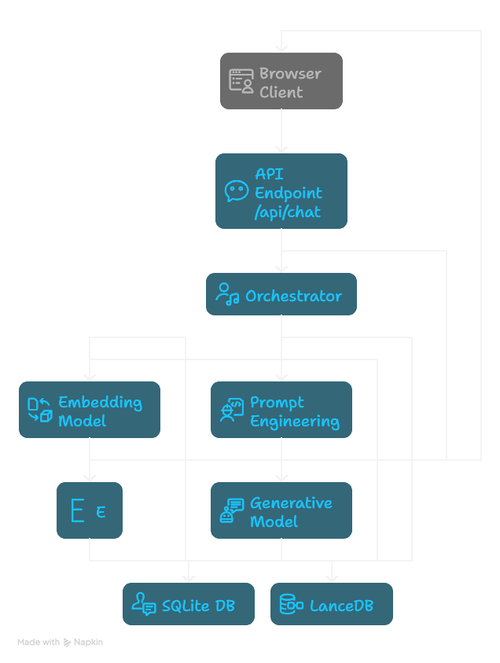

# 🤖 STAN Conversational AI Agent


A human-like, empathetic, and context-aware conversational AI agent built for the **STAN Internship Challenge**.  
This chatbot leverages **dual-memory architecture** (structured + semantic memory), emotional adaptability, and context retention to provide engaging and personalized interactions.

📺 **[Watch Demo Video](https://your-video-link-here.com)**

---

## 🚀 Features

- 🧠 **Personalized Long-Term Memory** – Remembers user details across sessions for continuity.
- 💬 **Human-Like Interaction** – Uses a crafted persona & prompt engineering to avoid robotic responses.
- 💡 **Contextual Awareness** – Combines short-term flow with long-term semantic memory for coherence.
- ⚡ **Dual-Memory System** – SQLite for structured facts, LanceDB for semantic embeddings.
- 🔧 **Scalable & Modular Design** – Clean separation of logic for easy integration and maintenance.

---

## 🏛️ Architecture

The agent’s architecture is based on a **dual-memory system**:

- **Structured Memory ("Facts")** → SQLite (profiles, chat logs, history).  
- **Semantic Memory ("Vibes")** → LanceDB (vector embeddings for context recall).  



---

## 🛠️ Tech Stack

- **Backend**: Node.js, Express.js  
- **LLM**: Google Gemini 1.5 Flash  
- **Structured DB**: SQLite  
- **Vector DB**: LanceDB  
- **Environment**: dotenv  

---

## ⚙️ Getting Started

### Prerequisites
Make sure you have the following installed:
- Node.js (v18 or higher)  
- npm (Node Package Manager)  
- Git  

### Installation

```bash
# Clone the repo
git clone https://github.com/your-username/stan-chatbot-node.git

# Navigate into project
cd stan-chatbot-node

# Install dependencies
npm install
```

### Environment Setup

Create a `.env` file in the root directory and add your Google API Key:

```env
GOOGLE_API_KEY="your_api_key_here"
```

### Run the Application

```bash
# Start the server
node server.js
```

Now open:  
👉 `http://localhost:3000`

---

## 📁 Project Structure

```
stan-chatbot-node/
├── .env                  # Environment variables
├── package.json          # Dependencies & scripts
├── server.js             # Entry point (Express server)
│
├── src/                  # Core application logic
│   ├── chatbot/
│   │   ├── llm_handler.js    # Prompt engineering + Gemini API calls
│   │   └── memory.js         # SQLite + LanceDB interactions
│   ├── routes/
│   │   └── chat.js           # API routes
│   └── config/
│       └── database.js       # DB connection + initialization
│
├── database/             # Local DB storage
│   ├── chatbot_memory.db # SQLite file
│   └── lancedb/          # LanceDB storage
│
├── public/               # Frontend demo
│   ├── index.html
│   ├── style.css
│   └── script.js
│
└── README.md             # Documentation
```

---

## 📡 API Endpoints

| Method | Endpoint     | Body Example                | Description                           |
|--------|-------------|-----------------------------|---------------------------------------|
| `POST` | `/api/chat` | `{ "userId": "123", "message": "Hi" }` | Sends a message, receives AI reply.   |
| `POST` | `/api/reset`| `{ "userId": "123" }`       | Resets history for the given user.    |

---

## 📄 License

This project is licensed under the **MIT License** – see the [LICENSE](LICENSE.md) file for details.

---

## 👤 Author

**Zeeshan Malik**  
- GitHub: [@your-github-username](https://github.com/your-github-username)  
- LinkedIn: [Your LinkedIn Profile](https://linkedin.com/in/your-linkedin)  
